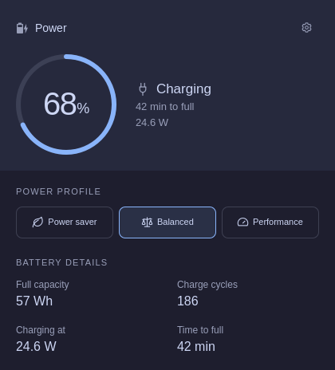

# Foamy Power

Battery status and power profiles for Omarchy Quattro.



## Install

Requires Python 3, UPower, `busctl`, `powerprofilesctl` from
power-profiles-daemon, and Symbols Nerd Font (included with Omarchy). Keep Omarchy’s built-in battery service enabled for
automatic profile switching.

```sh
omarchy plugin add https://github.com/foamrider/foamy-power.git --enable
```

Remove any previous power widget from the bar. The widget hides when no system
battery is present.

## Use

- Left-click to see battery readings and choose a power profile.
- Profile selections last until the power source changes.
- Open the cog to set separate AC and battery defaults, language, and bar percentage.
- Right-click to toggle the percentage on horizontal bars.

Language and percentage preferences are stored in `shell.json`. Power defaults
use Omarchy’s existing files in `~/.local/state/omarchy/powerprofiles` (or the
configured state directory). Plugging in or unplugging applies the matching default.
Charge limits are shown when available; the plugin does not change them.

## License

Licensed under [MIT](LICENSE). Omarchy and Lucide notices are in
[LICENSE-OMARCHY](LICENSE-OMARCHY) and [LICENSE-LUCIDE](LICENSE-LUCIDE).

Provided **as is**, without warranty or guaranteed support. Use at your own risk.
